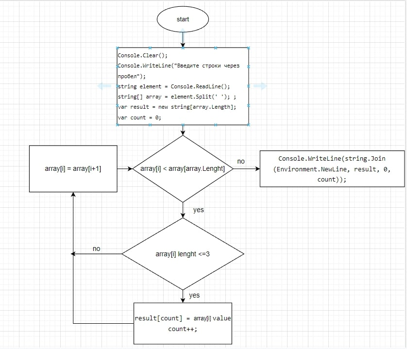

# Этапы решения задачи

1. считать элементы массива из консоли в формате строки
2. создать массив из строк и добавить в него считанные строки
3. найти элементы, длина которых больше или равна 3 с помощью foreach и if
4. вывести новый массив в консоль

## [ссылка на репозиторий GitHub](https://github.com/username483/final-work.git)
## Блок-схема

